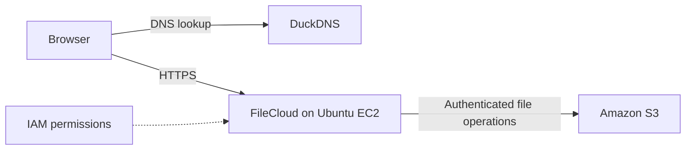

# Roshacloud — FileCloud on AWS

A personal cloud-storage deployment combining FileCloud on Ubuntu EC2, Amazon S3, IAM access controls, and HTTPS through a DuckDNS hostname. The project focuses on configuring and connecting cloud infrastructure to support authenticated file access.

**Stack:** AWS EC2 · S3 · IAM · Ubuntu Linux · FileCloud · DuckDNS · Let's Encrypt

[Architecture](docs/architecture.md) · [Setup guide](docs/setup.md) · [Validation checklist](docs/validation.md) · [FileCloud service](https://roshafiles.duckdns.org)

The service requires an authorized account. The documentation can be reviewed without signing in to FileCloud.

## Project scope

The deployment brings together compute, object storage, access control, DNS updates, and certificate renewal. FileCloud supplies the application, authentication, and file-permission features. This repository contains the deployment walkthrough, architecture notes, and example IAM policies.

| Component | Role |
| --- | --- |
| Ubuntu on EC2 | Runs the FileCloud application |
| Amazon S3 | Stores files managed by FileCloud |
| IAM | Controls the application's AWS permissions |
| DuckDNS | Provides a consistent hostname as the public IP changes |
| Let's Encrypt | Provides the HTTPS certificate and renewal mechanism |

## Request flow

FileCloud authenticates each user and checks file permissions before accessing managed storage. Scheduled DNS updates and certificate renewal support continued access as infrastructure details change. See the [architecture notes](docs/architecture.md) for more detail.

## Reproduce the deployment

Follow the [setup guide](docs/setup.md) to provision compute and storage, configure AWS access, install FileCloud, and set up DNS and HTTPS. The guide describes a reproduction path rather than an exact export of the original server. Its IAM-role approach is documented explicitly; the original authentication method and software versions were not recorded in this repository.

| File | Purpose |
| --- | --- |
| [docs/architecture.md](docs/architecture.md) | Components and request flow |
| [docs/setup.md](docs/setup.md) | Deployment instructions |
| [docs/validation.md](docs/validation.md) | Functional checks and troubleshooting |
| [examples/s3-policy.json](examples/s3-policy.json) | Bucket-scoped IAM policy template |
| [examples/ec2-trust-policy.json](examples/ec2-trust-policy.json) | EC2 role trust policy template |

Replace example values with your own resources and supply credentials privately on the deployment host.

## Validation status

The original project notes record completion in June 2026 and successful upload, download, and certificate-renewal checks. Historical test logs are not included. The [validation checklist](docs/validation.md) provides steps to repeat those checks and capture evidence on a deployment.

## Design tradeoffs

- A single EC2 instance keeps the deployment straightforward but does not provide application high availability.
- S3 stores managed files; separate backups are needed for FileCloud's database and configuration.
- Dynamic DNS provides a stable hostname, while continued access depends on the update job and instance availability.
- The public repository contains documentation and placeholder configurations. Credentials, private keys, and user files belong outside version control.
