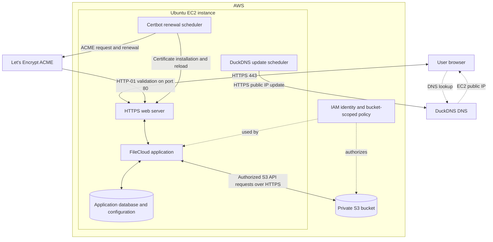

# architecture

## request flow

DNS resolves a name; file content does not pass through DuckDNS. The browser connects to FileCloud over HTTPS. FileCloud applies user permissions before interacting with S3. IAM controls the AWS operations available to the server independently of FileCloud user permissions.

## reproduction choices

The diagram uses server-mediated file transfer and Certbot HTTP-01 validation as the reproduction design. Apache is the web server assumed by the setup guide. The original certificate challenge method and web server configuration were not supplied. Optional FileCloud direct or optimized S3 uploads are outside this guide.

An EC2 instance role is the example AWS identity. S3 holds file objects, while application metadata and configuration still need separate backups. A single EC2 instance is a single point of failure.
